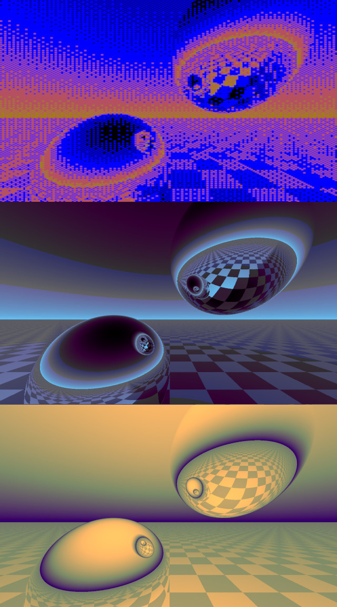

# Raytracer in Rust with GPU

Here you can find a port to Rust, of the Ray Tracer in Atari 8-bit BASIC by D. Scott Williamson ( https://bunsen.itch.io/raytrace-movie-atari-8bit-by-d-scott-williamson ).

I provide 3 implementations here:

- 2 CPU implementations (One that follows the Atari code line by line to get close to the the original output, and a fancier implementation in which I have replaced the dithering graphics with the usual color gradient, higher resolution, and multithreading for faster computation.)

- And a GPU implementation, based on the Rust library tch-rs, which is a wrapper for libtorch.

Beforehand, you need to make sure you got the libtorch installed and ready to use for tch-rs. You can get some information over there:

- [LaurentMazare/tch-rs](https://github.com/LaurentMazare/tch-rs)

- [home.futuretim.io/posts/tch_test/](https://home.futuretim.io/posts/tch_test/)

- [LaurentMazare/tch-rs/issues/866](https://github.com/LaurentMazare/tch-rs/issues/866)

You can also test a CPU-only implementation of the raytracer (without the libtorch dependancy). See [https://github.com/v-espitalier/Raytracer-rs](https://github.com/v-espitalier/Raytracer-rs) .

Once you installed libtorch, you can start playing with tensors, and test this GPU-based raytracer.

Compilation and run:

~~~
cargo build
/target/debug/raytracer
~~~

The code generates image files. You can then gather them in gif and convert them to a video using ImageMagick and ffmpeg respectively.

List of image files to single video:
~~~
ffmpeg -framerate 5 -pattern_type glob -i 'generated_imgs/img_atari_*.png' \
  -c:v libx264 -pix_fmt yuv420p -vf "scale=trunc(iw/2)*2:trunc(ih/2)*2" video_atari.mp4

ffmpeg -framerate 15 -pattern_type glob -i 'generated_imgs/img_cpu_*.png' \
  -c:v libx264 -pix_fmt yuv420p -vf "scale=trunc(iw/2)*2:trunc(ih/2)*2" video_cpu.mp4

ffmpeg -framerate 30 -pattern_type glob -i 'generated_imgs/img_gpu_*.jpg' \
  -c:v libx264 -pix_fmt yuv420p -vf "scale=trunc(iw/2)*2:trunc(ih/2)*2" video_gpu.mp4
~~~

See also an ASM version created by Nanochess, that fits on a boot sector (https://github.com/nanochess/RayTracer).

# Licence
Raytracer-tch-rs is distributed under the terms of the MIT license. 
See [LICENSE](https://github.com/v-espitalier/Raytracer-tch-rs/blob/main/LICENSE) for more details.